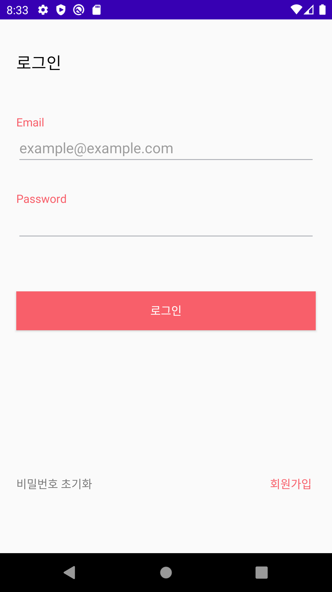
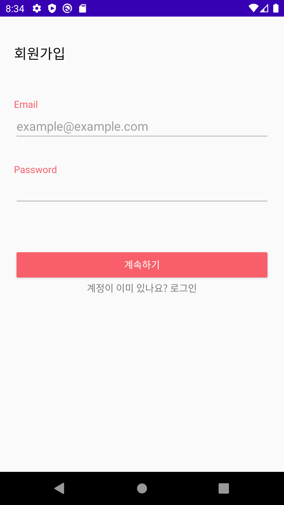
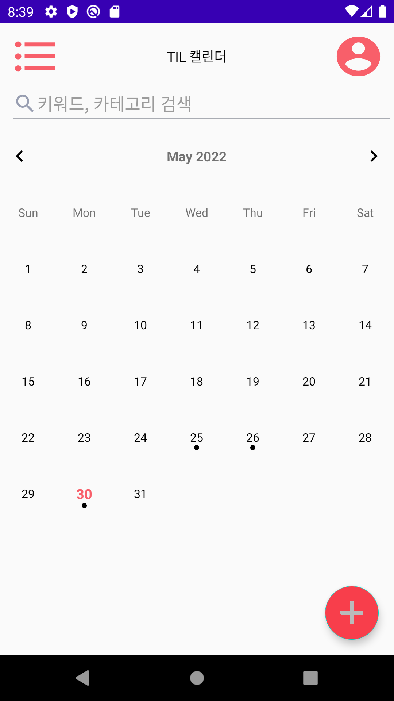
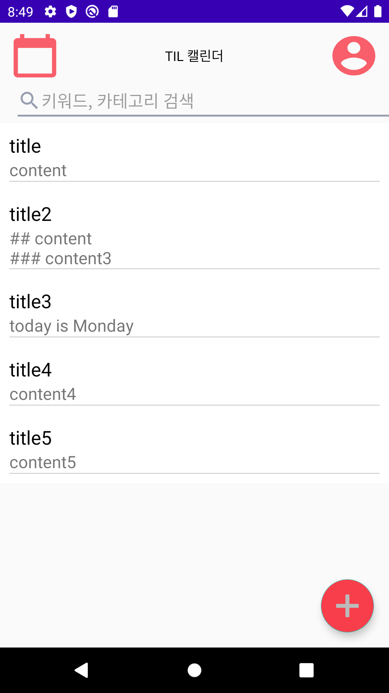
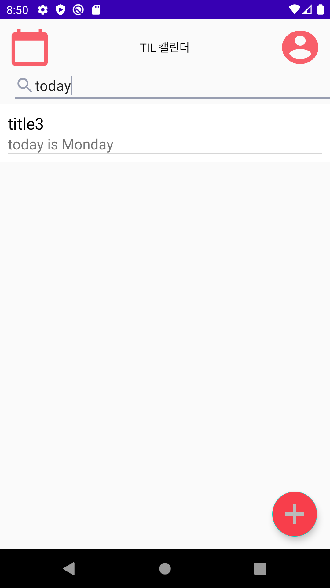
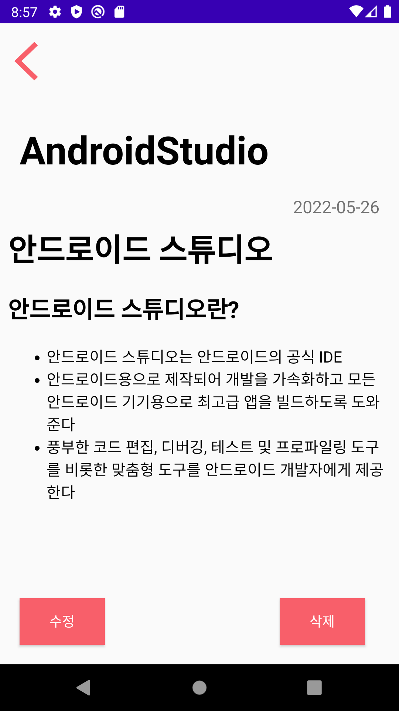
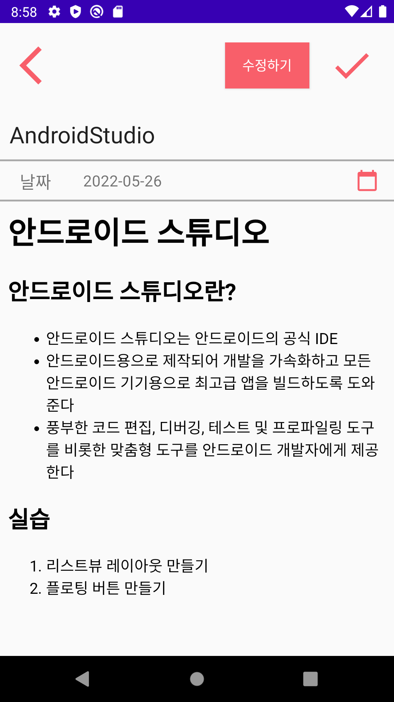
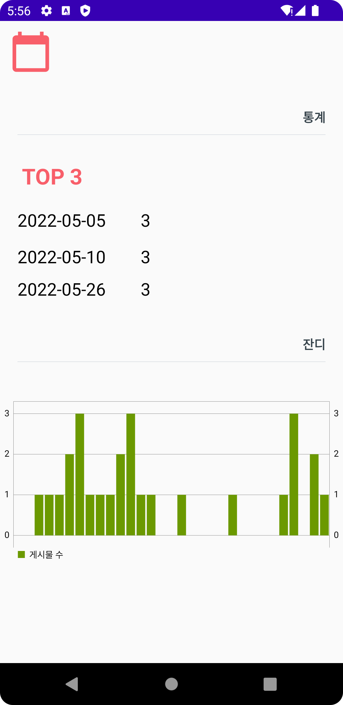

# TIL Frontend Project

## ✨ 프로젝트 소개
휴대폰으로 간단하게 TIL을 기록하고 클라우드에 저장할 수 있는 애플리케이션

## Contributors
### FrontEnd
|  |  |
| :----: | :----: |
| [최명빈](https://github.com/choimyungbin) | [조희원](https://github.com/huihuiwon) |

### BackEnd
|  |  |  |
| :----: | :----: | :----: |
|[김동환](https://github.com/gidskql6671) | [문정원](https://github.com/gaarden) | [황지원](https://github.com/JiwonHwang01) |

## Features
* 회원가입, 로그인
* 게시글 작성, 수정
  * 마크다운 지원
* 게시글 조회, 삭제
* 게시글 검색
* TIL 수행 여부 표시
* 최근 6개월 동안 TIL 잔디 조회
* 최근 6개월 동안 게시글 가장 많이 쓴 날 조회

## 기술 스택
### FrontEnd
- Kotlin
- Android Studio
  - Android Target SDK 31
  - Andorid Minm SDK 26
### BackEnd - Server
- Java Spring Boot
- JPA
- MySQL
### BackEnd - Data
- Python

### 서버 배포
- Heroku

## ScreenShots
### 인증 처리

JWT를 사용한 회원가입과 로그인을 구현하였다.

### 게시글 목록

달력 혹은 리스트 형태로 게시글의 목록을 조회할 수 있다.

### 게시글 검색

키워드를 사용하여 게시글을 검색할 수 있다.
### 게시글 상세보기

작성한 게시글을 마크다운이 적용된 모습으로 볼 수 있다.
### 게시글 작성

마크다운 형식으로 게시글을 작성할 수 있다.

### 마이 페이지
  

최근 작성한 TIL 통계를 조회할 수 있다.

## API 문서
- [PostMan Docs](https://documenter.getpostman.com/view/13315664/UyxdJogT)
- [Swagger Docs](https://gdsc-knu-til.herokuapp.com/swagger-ui/index.html)

## Git Strategy & Convention
[Git Strategy & Convention Wiki](https://github.com/GDSC-KNU/TIL-Backend/wiki/Git-Strategy-&-Convention-Wiki)

## Heroku 배포 정보 문서
[Heroku 배포 Wiki](https://github.com/GDSC-KNU/TIL-Backend/wiki/Heroku-%EB%B0%B0%ED%8F%AC)
